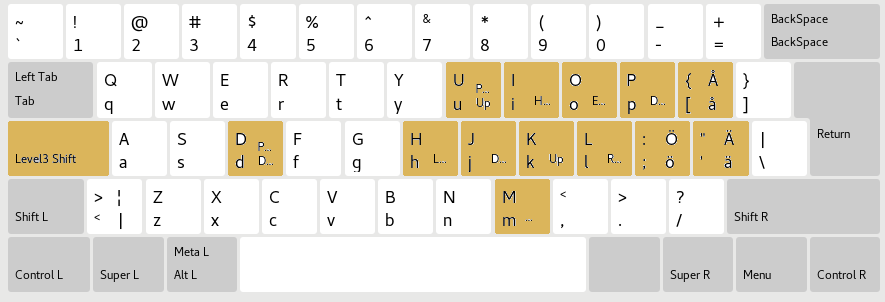

# Vim Inspired Custom Keyboard Layout

Compare the `xkb` and `xkb.bak` to see the changes. I am too lazy to make a patch. Test your changes in a VM first. You will brick the keyboard if you fuck up the config files. 

`Caps + h`	--> 	`Left`

`Caps + j`	--> 	`Down`

`Caps + k`	--> 	`Up`

`Caps + l`	--> 	`Right`

`Caps + i`	--> 	`Home`

`Caps + o`	--> 	`End`

`Caps + p`	--> 	`Delete`

`Caps + e`	--> 	`Esc`

`Caps + d`	--> 	`Down`

`Caps + u`	--> 	`Up`

`Caps + m`	--> 	`Menu`

`Caps + [`	--> 	`å`

`Caps + {`	--> 	`Å`

`Caps + ;`	--> 	`ö`

`Caps + :`	--> 	`Ö`

`Caps + '`	--> 	`ä`

`Caps + "`	--> 	`Ä`

